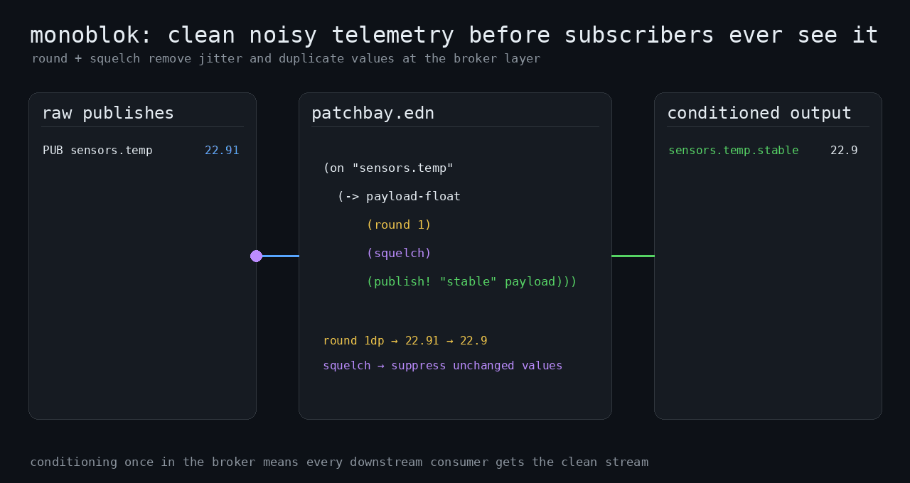
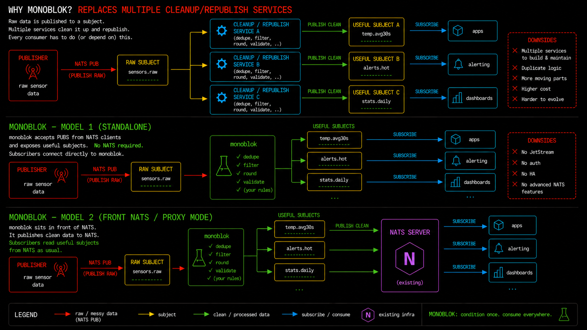
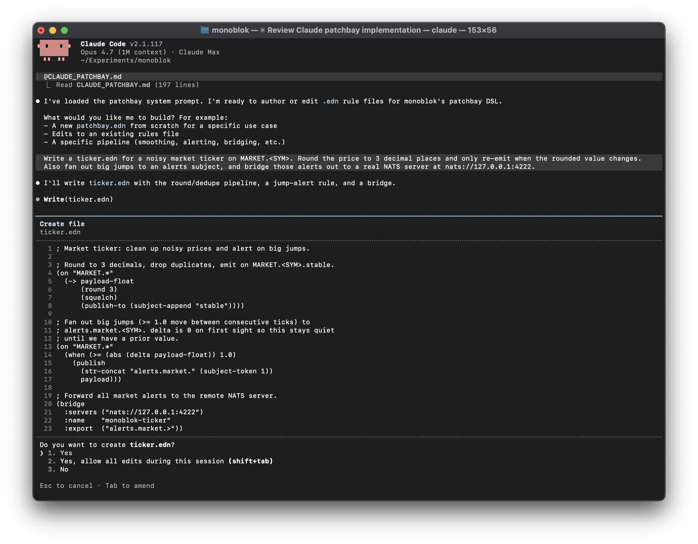
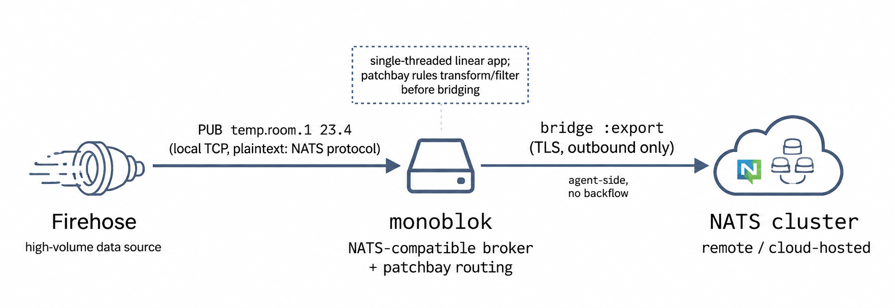

# monoblok Overview

> A NATS-core compatible messaging system that conditions subjects before subscribers see them.
> 
> Fix raw input streams once, not in every subscriber.

## Rationale

It is not uncommon for systems to contain some _caretaker_ services that subscribe to ingress NATS subjects to clean up and republish a raw stream before the real business starts. This might include rounding, dedup, deadband, JSON demux, OHLC bars, threshold alerts and so on. High velocity or miniscule changes don't always have value downstream. monoblok lets you declare that tidying work once, leveraging efficient implementations of common tasks as rules at the broker, instead of writing _rounding logic_ N times in N services.

**Declare it once, as rules, in the broker.**

monoblok speaks NATS. Point your NATS clients at it and the conditioning happens on the way through. Rules live in patchbay, a small S-expression DSL.



Common ways of running monoblok:
- Standalone broker: clients connect directly to monoblok for lightweight NATS-core pub/sub with signal conditioning built in.
- Signal conditioning front door: publishers send raw events to monoblok, monoblok cleans them, then forwards selected subjects to a real NATS cluster.



monoblok is written in C with libuv and builds on Linux and macOS. It aims to be **fast**, even on entry level/shared hardware. There are no scientific measurements yet. There are some [benchmark scripts](../scripts) and [results](../bench-results).

[tinyblok](https://github.com/lexvicacom/tinyblok) is an implementation of the same idea, but for microcontrollers.


[Read the introductory blog post](https://alexjreid.dev/posts/monoblok/) [and friends](https://alexjreid.dev/tags/monoblok/).

## Public demo server

A [public demo server](https://alexjreid.dev/posts/monoblok-demo/) runs on `demo.monoblok.host:4222`, with a bridged NATS server on `demo.monoblok.host:4223`. All you need is the NATS CLI. The loaded patchbay is [`demo.edn`](../examples/demo.edn) - if this makes no sense, don't worry, patchbay will be introduced later in this document.

Open a few terminals:

```sh
nats -s demo.monoblok.host:4222 sub 'demo.sensors.>'
(new terminal)
nats -s demo.monoblok.host:4223 sub '>'
(new terminal)
nats -s demo.monoblok.host:4222 pub demo.sensors.temp 21.001
nats -s demo.monoblok.host:4222 pub demo.sensors.temp 21.002
nats -s demo.monoblok.host:4222 pub demo.sensors.temp 2331.104
nats -s demo.monoblok.host:4222 pub demo.sensors.temp 21.104
```

Conditioned values are visible on the first subscription, as well as the input to `demo.sensors.temp` due to our subscription filter. As the `2331.104` value breaches a threshold, it is also exported to NATS so is visible on the second subscription.

See [docs/demo.md](./demo.md) for the loaded patchbay and subjects worth subscribing to.

## Install

### Binary (macOS/Linux)
This script downloads and unpacks the latest release into the current directory. See [scripts/start.sh](../scripts/start.sh)

You can run it with:

```sh
curl -fsSL https://raw.githubusercontent.com/lexvicacom/monoblok/main/scripts/start.sh | bash
```

Or [grab the latest](https://github.com/lexvicacom/monoblok/releases/latest).

## patchbay

patchbay is a small S-expression DSL describing how every incoming publish gets filtered, conditioned, and re-routed. It is shared by the monoblok server and [tinyblok](https://github.com/lexvicacom/tinyblok) on MCUs.

Top-level forms are `(on SUBJECT-FILTER BODY)`. Wildcards are NATS-style: `*` matches one token, `>` matches the tail. EDN is canonical for hand-written patchbays; `.json` files are accepted for tooling compatibility.


```edn
(on "sensors.*"
  (when (> payload-float 30.0)
    (publish! (subject-append "high") payload)))

; Round to 1dp, drop duplicates, emit on the .stable sub-subject.
(on "sensors.*"
  (-> payload-float
      (round 1)
      (squelch)
      (publish! (subject-append "stable"))))
```

The root [`patchbay.edn`](../patchbay.edn) is a short tour.

The vocabulary is borrowed from electronics (`squelch` suppresses until the value changes, `deadband` ignores movement smaller than a threshold) because the names already mean the right thing. A "patchbay" in a studio is a grid of jacks you wire between sources and destinations, which is exactly what the DSL looks like on the page.

JSON payloads like `{"temp":12.5,"hum":80}` can be demuxed onto scalar sub-subjects (`json-demux!`) and conditioned the same way; dotted object paths are supported up to four levels deep. The root [`patchbay.edn`](../patchbay.edn) includes a starter rule for this, while [`json-frames.edn`](../examples/json-frames.edn) shows the fuller version.

Time-windowed `bar!` closes and `moving-* :ms` evictions are driven by libuv timers scheduled at the next active patchbay deadline.

The root [`patchbay.edn`](../patchbay.edn) is the short tour. Full syntax lives in [docs/patchbay.md](./patchbay.md), with a one-line operator summary in [docs/patchbay-cheatsheet.md](./patchbay-cheatsheet.md). Runnable examples live in [`examples/`](../examples/).

| file                                              | what it shows                                                   |
|---------------------------------------------------|-----------------------------------------------------------------|
| [`sensors.edn`](../examples/sensors.edn)           | round + squelch on a noisy sensor                               |
| [`office-temp.edn`](../examples/office-temp.edn)   | moving-average alert + all-clear via `transition` and `count!`  |
| [`ticker.edn`](../examples/ticker.edn)             | market data: round, squelch, big-jump alerts, bridge            |
| [`bars.edn`](../examples/bars.edn)                 | tick-count OHLC bars per symbol                                 |
| [`latency-stats.edn`](../examples/latency-stats.edn) | live p50/p95/p99/stddev over a sliding window                 |
| [`clocked.edn`](../examples/clocked.edn)             | silence detection, debounce, sampling, and clocked aggregates |
| [`json-frames.edn`](../examples/json-frames.edn)   | `json-demux!` a JSON-emitting device into scalar sub-subjects   |
| [`rental-car.edn`](../examples/rental-car.edn)     | quantize + deadband + over-rev hold-off alert                   |
| [`bridge.edn`](../examples/bridge.edn)             | forward selected subjects to a real NATS server                 |
| [`demo.edn`](../examples/demo.edn)                 | tour of every primitive on `demo.sensors.*`                     |
| [`lvc.edn`](../examples/lvc.edn)                   | `$LVC.>` cache replay: a late joiner gets the last value        |


### Validate and debug rules

Run a patchbay directly with `monoblok examples/<file>.edn` or `.json`; form-lint without starting the server with `monoblok --validate examples/<file>.edn`.

For quick patchbay debugging, `--soundcheck` runs the same evaluator without opening a NATS socket. It reads newline-delimited `SUBJECT|payload` rows on stdin, passes inputs through stdout, and prints any `publish!` emissions.

```sh
printf 'sensors.temp|31\n' | monoblok --soundcheck examples/sensors.edn
printf 'sensors.temp|31\n' | monoblok --soundcheck --soundcheck-label examples/sensors.edn
```

### `--trace`: per-evaluation debugger

Prints every patchbay form the evaluator visits to stderr, with result and elapsed time. 

```
$ monoblok --port 4222 --patchbay patchbay.edn --trace
trace: sensors.temp 42.5
  rule 0 (on "sensors.*") matched
  (when (> payload-float 30) (publish! (subject-append "high") payload))
    (> payload-float 30)
      => true [124µs]
    (publish! (subject-append "high") payload)
      => published "sensors.temp.high" 42.5 [549µs]
total [3ms]
```

### Coding assistants

A nice way to learn it is with an LLM that has the DSL loaded as project context. [docs/AGENTS_PATCHBAY.md](./AGENTS_PATCHBAY.md) is a self-contained, agent-neutral prompt that teaches Codex and other coding agents Patchbay. Append it to your project's `AGENTS.md` so compatible tools pick it up automatically when editing `.edn` rule files:

```sh
curl -fsSL https://raw.githubusercontent.com/lexvicacom/monoblok/main/docs/AGENTS_PATCHBAY.md >> ./AGENTS.md
```

[docs/CLAUDE_PATCHBAY.md](./CLAUDE_PATCHBAY.md) is the Claude-specific version for `CLAUDE.md`. Once loaded, describe the stream you have and the stream you want.

<p align="center">
  
</p>

For some elaborate generated demos, see [`advanced-examples/`](../advanced-examples/). They are intentionally a bit over the top, but they give a feel for what is possible.

## `$LVC.*`: last-value-cache stream

Top-level `(lvc ...)` forms opt subjects into the last-value cache. Subscribing to `$LVC.foo.bar` joins a live stream of `foo.bar`: current cached value first (if any), then every subsequent opted-in publish. Wildcards work. `PUB $LVC.*` is rejected.

```edn
(lvc ["sensors.>" "alerts.>"])
```

```
PUB foo.bar 11      ; cache = 11
PUB foo.bar 12      ; cache = 12
SUB $LVC.foo.bar    ; -> immediately receives 12
PUB foo.bar 13      ; -> subscriber receives 13
```

Absent `(lvc ...)`, LVC is off and the publish path does no cache work. `--no-lvc` disables configured LVC filters.

## NATS support

monoblok implements the NATS core pieces it needs to behave like a small broker.

| Feature | Support |
|---|---|
| `PUB` / `SUB` / `UNSUB` / `MSG` | yes |
| wildcards | yes |
| request/reply | yes |
| queue groups | no |
| headers | no |
| `$LVC.*` last-value replay | yes, monoblok extension |
| bridge to real NATS | export-only |
| TLS/auth on the local server | no; terminate in front of monoblok or bridge to real NATS |
| JetStream | no |
| clustering | no |

### As a bridging client to a NATS server

<p align="center">
  
</p>

monoblok can forward a subset of local publishes to a real NATS cluster. **Export-only**: nothing flows in from the remote. TLS and `.creds` files are supported via vendored [nats.c](https://github.com/nats-io/nats.c).

Zero or one `(bridge ...)` form in the patchbay file configures it:

```edn
(bridge
  :servers  ["tls://connect.ngs.global:4222"]
  :creds    "/etc/monoblok/ngs.creds"
  :tls      true
  :name     "monoblok-prod-1"
  :export   ["telemetry.>" "alerts.>"])
```

A local publish (from a NATS client or a patchbay rule) whose subject matches any `:export` filter is forwarded as-is. Local subscribers are served first, bridge second, so a slow remote can't starve local delivery. Reconnects are handled inside nats.c.

Full keyword reference (auth, timeouts, reconnect tuning) in [docs/patchbay-cheatsheet.md](./patchbay-cheatsheet.md).

## Snapshots

Warm-start from disk so restarts don't lose the cache or the state inside gates and windows.

```
monoblok --snapshot /var/lib/monoblok/state.mblk --snapshot-every 10
```

`--snapshot PATH` loads on startup if it exists (missing is fine). `--snapshot-every SECONDS` runs a periodic dump using atomic temp-file + rename. If the patchbay file changes between runs, LVC entries still load; rule state for any rule 
whose filter no longer matches at its recorded position is skipped with a warning.

Patchbay state is usually per rule and per subject. Avoid unbounded subject tokens such as timestamps, user IDs, or raw device-generated strings unless you intend to create state for each one.

## Design

Each monoblok process owns one libuv loop that owns accept, per-connection read/write completions, router state, and the LVC. Because everything happens on the loop thread, fan-out can append straight into each subscriber's outbound buffer with no locking and kick one `uv_write` per connection per publish.

Everything application-level runs on a single thread: parsing, subject matching, rule evaluation, fan-out, write buffering. The kernel still uses your other cores for I/O, but once a byte arrives it's serial through monoblok. Adding a second thread would mean atomics or locks. The cap is one core's worth of throughput per instance, and the benchmarks below show that's a lot of headroom for signal conditioning workloads. 

## Deploying

monoblok has low hardware requirements. A 2-vCPU VM with 256 MB+ of RAM is a good starting point. monoblok runs on one core; the kernel net stack and io_uring workers will use the other.

The systemd unit plus `--snapshot` handles restarts: a crash or reboot loses at most one snapshot interval of in-flight conditioning state. If you're bridging upstream, that cluster can be thought of as the system of record (anything already exported is durable there).

### systemd

Linux release tarballs ship a unit file and installer in [scripts/](../scripts/):

```sh
sudo bash scripts/install-systemd.sh
sudo systemctl enable --now monoblok
journalctl -u monoblok -f
```

Drops the binary at `/usr/local/bin/monoblok`, the patchbay at `/etc/monoblok/patchbay.edn`, snapshots under `/var/lib/monoblok/state.mblk` (every 10s plus on stop), and creates a `monoblok` system user.

## How fast is it?

tl;dr: It's likely to be fast enough. Getting meaningful benchmarks turned out to be trickier than I first realised. No specific percentages here; run `scripts/bench-with-nats-server.sh` on your own hardware if numbers matter to you.

The **shape** of the comparison vs. nats-server, though, is consistent across runs:

- **nats-server wins on pure publish throughput on big machines.** Multi-threaded acceptance and a more battle-hardened parse loop both help when there's no fan-out work to spread the cost over and there are spare cores to spread it across. On small ARM VPSes the gap narrows or disappears: nats-server has less parallelism to exploit, and monoblok's single-threaded design has no overhead to pay.
- **The two are roughly comparable at low fan-out** (1-10 subscribers per publish).
- **monoblok scales better with subscriber count.** The single-threaded deduped-kicks fan-out avoids the per-subscriber lock work a multi-threaded server pays. Crossover happens somewhere around 10-30 subscribers; the further past that you go, the bigger monoblok's lead.

Worth keeping in mind: nats-server has a decade of production-grade performance work behind it. Any monoblok win in these benches should be read as "the single-threaded design happens to fit this specific workload shape well," not "monoblok is faster than nats." The right tool for most pub/sub deployments is still nats-server; monoblok is for the cases where the patchbay or LVC features earn their place, and "fast enough on a small box" is a happy side-effect of the design, not the headline.

## Building from source

See the repository [README](../README.md) for CMake build targets and smoke tests.

## License

MIT. See `LICENSE`.
