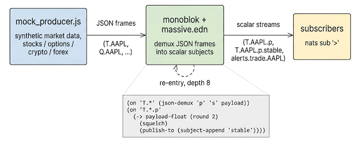

# json-massive

<p align="center">
  
</p>

High-frequency market data is a poster-case for monoblok: data moves
fast, most of the movement isn't worth a downstream message, and every
subscriber would otherwise re-implement the same rounding / dedupe /
demux logic. This example shows the conditioning happening once, at the
broker, in front of a synthetic Massive-shape feed.

End-to-end example with two pieces:

- **`mock_producer.js`**, synthetic NATS producer simulating a
  Massive-shape market data feed (stocks, options, crypto, forex). No
  external connection, no API key; it generates frames locally and
  publishes straight into monoblok over the NATS protocol. Subjects are
  shaped `<ev>.<symbol-or-pair>` and the JSON payloads match the
  documented field sets at [www.massive.com](https://www.massive.com).
- **`massive.edn`**, patchbay that demuxes the JSON frames into
  per-field scalar streams and runs a couple of downstream rules on
  them (rounded mirror, big-move alerts).

You need both running: the producer feeds frames in, the patchbay
reshapes them on the way through.

**AI created this informational test harness as an illustration.**

## Run

```bash
# terminal 1: start monoblok with the demuxing patchbay
monoblok --port 4222 examples/json-massive/massive.edn

# terminal 2: start the producer
node examples/json-massive/mock_producer.js

# terminal 3: peek at the firehose
nats sub '>'
```

## Subject map

| Subject prefix       | Asset class       | JSON shape (key fields)                       |
|----------------------|-------------------|-----------------------------------------------|
| `T.<SYM>`            | stock trade       | `p s c t q` (sym in subject + frame)          |
| `Q.<SYM>`            | stock NBBO quote  | `bp bs ap as t`                               |
| `AM.<SYM>`           | stock minute agg  | `o c h l v vw op a z s e`                     |
| `T.O:<OCC>`          | option trade      | `p s c t q` (OCC-format symbol)               |
| `Q.O:<OCC>`          | option quote      | `bp bs ap as t q`                             |
| `XT.<PAIR>`          | crypto trade      | `pair p s c i x t r`                          |
| `XQ.<PAIR>`          | crypto quote      | `pair bp bs ap as t r`                        |
| `XA.<PAIR>`          | crypto minute agg | `pair o c h l v vw z s e`                     |
| `C.<PAIR>`           | forex quote       | `pair b a t` (single-letter b/a, no sizes)    |
| `CA.<PAIR>`          | forex minute agg  | `pair o c h l v s e`                          |

Crypto pairs are `BTC-USD` style (no `X:` prefix on the wire). Forex
pairs are six-char concatenations (`EURUSD`). Option symbols use the OCC
format prefixed with `O:` (e.g. `O:AAPL250620C00200000`).

## Patchbay

`massive.edn` runs a staged pipeline against the trade subject:

1. `(json-demux ...)` against `T.*` fans out `T.<SYM>.p`, `T.<SYM>.s`.
2. A second rule matches the demuxed `T.*.p` subject (via re-entry) and
   emits a rounded, deduplicated mirror on `T.<SYM>.p.stable`.
3. A third rule alerts on big single-trade jumps to `alerts.trade.<SYM>`.

Same shape for `Q.*` and `AM.*`. The re-entry behaviour (patchbay-emitted
publishes match downstream rules, capped at depth 8) is what makes the
staged form work.

Worth noting: Massive's delayed feeds already deliver OHLC bars on the
`AM` / `XA` / `CA` channels (server-side aggregation), so the patchbay
just demuxes those frames into scalars instead of recomputing
open / high / low / close from raw trades. If you only have a trade
stream and need to build bars locally, see `examples/bars.edn` (uses
`bar`).

## Env

| Variable     | Default     | Description                                |
|--------------|-------------|--------------------------------------------|
| `NATS_HOST`  | `127.0.0.1` | NATS host to connect to                    |
| `NATS_PORT`  | `4222`      | NATS port                                  |
| `RATE`       | `1`         | Scales every interval (2 = 2x faster)      |

No npm dependencies; the producer talks the NATS protocol directly over
a plain `net.Socket`.
