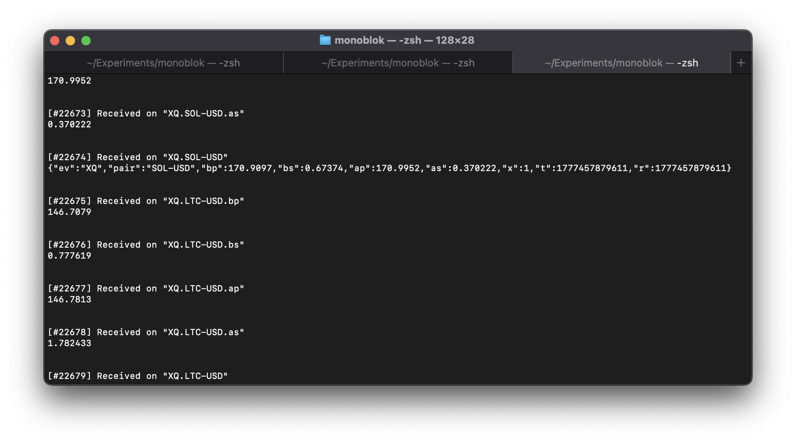

# json-massive

<p align="center">
  
</p>

High-frequency market data is a poster-case for monoblok: data moves
fast, most of the movement isn't worth a downstream message, and every
subscriber would otherwise re-implement the same rounding / dedupe /
demux logic. This example shows the conditioning happening once, at the
broker, in front of a synthetic Massive-shape feed. [I posted more about this in this post](https://alexjreid.dev/posts/monoblok-massive/).

This end-to-end example with two pieces:

- [mock_producer.js](./mock_producer.js), synthetic NATS producer simulating a
  Massive-shape market data feed (stocks, options, crypto, forex). No
  external connection, no API key; it generates frames locally and
  publishes straight into monoblok over the NATS protocol. Subjects are
  shaped `<ev>.<symbol-or-pair>` and the JSON payloads match the
  documented field sets at [www.massive.com](https://www.massive.com). **AI was used to create this producer as an illustration.** In reality, you might develop a simple websocket, MQTT, mcast or whatever client to source and land the raw data, depending on your setup.
- [massive.edn](./massive.edn), patchbay that demuxes the JSON frames into
  per-field scalar streams and runs a couple of downstream rules on
  them (rounded mirror, big-move alerts).

You need both running: the producer feeds frames in, the patchbay
reshapes them on the way through.

## Run

```bash
# terminal 1: start monoblok with the demuxing patchbay
# if you don't need the subject last value cache, save some cpu by turning it off
monoblok --no-lvc examples/json-massive/massive.edn

# terminal 2: start the producer
node examples/json-massive/mock_producer.js

# terminal 3: peek at the raw stream
nats sub '>'
```

<p align="center">
  
</p>

The raw stream makes the conditioning visible: raw `T.<SYM>` JSON frames
land alongside the demuxed `T.<SYM>.p` / `.s` scalar streams and the
deduplicated `T.<SYM>.p.stable` mirror. One screenshot is usually enough
to see that subscribers downstream of monoblok can pick the exact slice
they need (a single field, a rounded mirror, an alert) without parsing
the original JSON or re-implementing the dedupe.

## monoblok config (patchbay)

[massive.edn](./massive.edn) runs a staged pipeline against the trade subject:

1. `(json-demux! ...)` against `T.*` fans out `T.<SYM>.p`, `T.<SYM>.s`.
2. A second rule matches the demuxed `T.*.p` subject (via re-entry) and
   emits a rounded, deduplicated mirror on `T.<SYM>.p.stable`.
3. A third rule alerts on big single-trade jumps to `alerts.trade.<SYM>`.

Same shape for `Q.*` and `AM.*`. The re-entry behaviour (patchbay-emitted
publishes match downstream rules, capped at depth 8) is what makes the
staged form work.

> Massive's delayed feeds already deliver OHLC bars on the
`AM` / `XA` / `CA` channels (server-side aggregation), so the patchbay
just demuxes those frames into scalars instead of recomputing
open / high / low / close from raw trades. If you only have a trade
stream and need to build bars locally, see `examples/bars.edn` (uses
`bar!`).

## mock_producer environment variables

| Variable     | Default     | Description                                |
|--------------|-------------|--------------------------------------------|
| `NATS_HOST`  | `127.0.0.1` | monoblok host to connect to                |
| `NATS_PORT`  | `4222`      | monoblok port                              |
| `RATE`       | `1`         | Scales every interval (2 = 2x faster)      |

No npm dependencies; the producer talks the NATS protocol directly over
a plain `net.Socket`.
